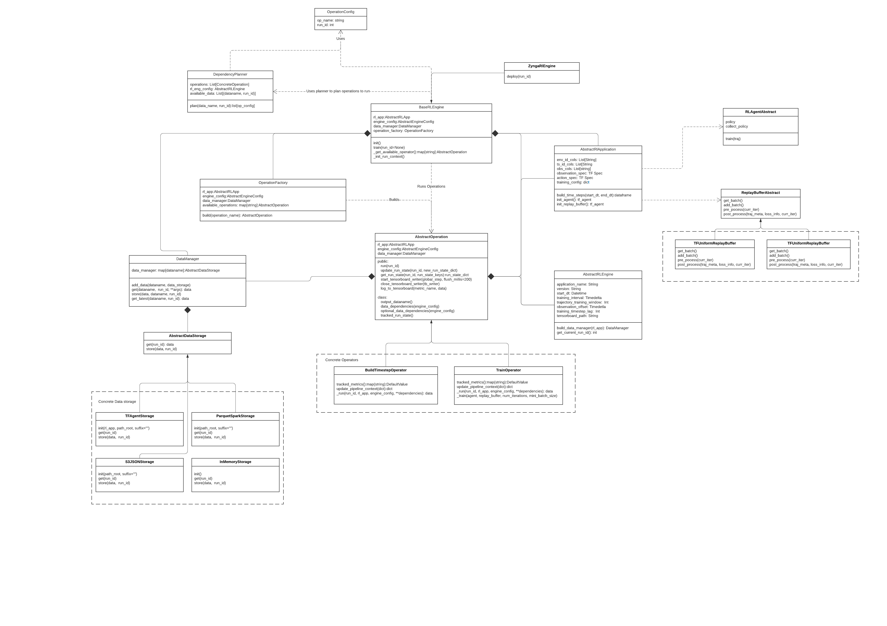

# RL Bakery

## Overview
RL Bakery makes it easy to build production batch Deep Reinforcement Learning and Contextual Bandits applications that train with offline data. What does that mean? At [Zynga](http://www.zynga.com), we use this to personalize our games, one example is picking the best time of day to send notifications, based on each user's context. This application "deploys" the Agent once per day, generating a batch of message time Actions for each user. On a daily basis, the historic trajectories of user state, action and rewards are gathered (offline) to train the Agent for the next update.  RL Bakery simplifies gathering offline RL data and formatting it at scale for lower level RL algorithm libraries. This [talk](https://www.youtube.com/watch?v=q4b-HHG5dG4) explains our usages at Zynga and the challenges with production RL. The Deep RL applications created by this library are run in production for millions of users per day.

## Authors
Patrick Halina, Mehdi Ben Ayed, Peng Zhong, Curren Pangler

## FAQ

### How is RL-Bakery related to other libraries?
RL-Bakery is built on top of [TF-Agents](https://github.com/tensorflow/agents/tree/master/tf_agents) as an implementation of the RL Algorithms. There's a lot of other open source libraries that implement RL Algorithms, like [Keras RL](https://github.com/keras-rl/keras-rl), [Dopamine](https://github.com/google/dopamine) or [SEED](https://github.com/google-research/seed_rl). In the future, RL-Bakery could make it easier to support other implementations.

We use [OpenAI Gym](https://gym.openai.com/) to test the library with canonical simulated environments, like [Cartpole](rl_bakery/example/cartpole.py). This isn't used for our production applications.

The library operates at the same level as [ReAgent](https://github.com/facebookresearch/ReAgent) and [Ray RLlib](https://docs.ray.io/en/latest/rllib.html). The difference is that RL-Bakery does not implement RL algorithms like PPO or DQN itself, it uses off the shelf implementations from open source libraries. RL-Bakery simply manages the data over time and at scale, then presents the historic data to other libraries that have implementations (we currently only support TF-Agents.) RL-Bakery is also runs seamlessly on existing Spark clusters, without the need to reconfigure Spark.

### What other technologies does this library require?
RL-Bakery uses Spark to manage and transform data, so a Spark cluster (2.4+) is required. We also use Tensorflow 2.0.

Note that we develop and test on our laptops using "local" PySpark clusters provided by the PySpark libraries. You should be able to get this library running locally without much more effort than a Pip install. However, a real Spark cluster is required to run this at scale.

### What applications should use this library?
This library helps create RL applications that do batch training on a regular basis over time. Suppose you want to personalize a website with an RL Agent; the Agent chooses optimized values for each user based on their unique context. The Agent can be updated once per day using the batch of offline data collected over the previous 24 hours. RL-Bakery was created for these types of applications, it makes it easier to manage the data over multiple days and combine it into a trajectory format required to update RL Agents.

### What applications shouldn't necessarily use this library?
These applications don't currently benefit from the library:
 * Researching/developing new RL algorithms on simulated environments (our library simply utilizes existing off the shelf libraries for executing RL algorithms like DQN).
 * If your data is very small, the overhead of using Spark may not be worth it.
 * If you're only applying this to simulated environments for training as opposed to some real world environment, lower level algorithm libraries work well for this.

### How are RL Agents "deployed"
A trained RL Agent is simply a trained Tensorflow model. It can be deployed to a live model service (eg. [https://aws.amazon.com/sagemaker/](https://aws.amazon.com/sagemaker/) or [Seldon-Core](https://github.com/SeldonIO/seldon-core). You can also use the trained model to generate a batch of Actions for a population.

## Usage
New applications are created by inheriting from the RLApplication class and implementing a few functions. For example, specifying the Agent algorithm to use and how to get data for a specific time period. RL Bakery can then execute the application to construct (State, Action, Reward, Next State) trajectories to train an RL Agent. A trained Agent is basically a deep learning model, which can  be served in real time or used to generate batch values for a population of environments.

See [rl_bakery/example/cartpole.py](rl_bakery/example/cartpole.py) for an example with the OpenAI cartpole environment. While that example uses an [OpenAI Gym](https://gym.openai.com/) environment, typical applications for RL Bakery will get state from a warehouse.


## Implementation Overview
RL Bakery utilizes [Apache Spark]( https://spark.apache.org/) to gather and transform data into trajectories of (State, Action, Reward, Next State). RL Bakery does not implement any RL Algorithms like PPO, TD3, DQN, A3C etc. Instead, we wrap the [TF-Agents]( https://github.com/tensorflow/agents) library.

Class diagram:


 
## Setup

### Github
This library is meant to be run on a Spark cluster. If you're testing this locally, you can simply use the PySpark library.
This assumes you have Python 3.6+ installed.
1. Clone repo, cd to root dir
1. Create a virtual env: `python3 -m venv venv`
1. `source venv/bin/activate`
1. Install packages: `pip3 install -r requirements.txt`

To run this on a Mac, you must install java to run locally with pyspark.  https://www.java.com/en/download/mac_download.jsp
Add 'export JAVA_HOME=/Library/Internet\ Plug-Ins/JavaAppletPlugin.plugin/Contents/Home' to your .bash_profile

### PyPI
This is coming soon!

## Tests
Unit tests with this command

```python -m unittest discover rl_bakery -p 'test_*.py'```

## Building
To build a wheel run this command:

```python setup.py bdist_wheel```

A wheel distribution will then be available in dist directory
